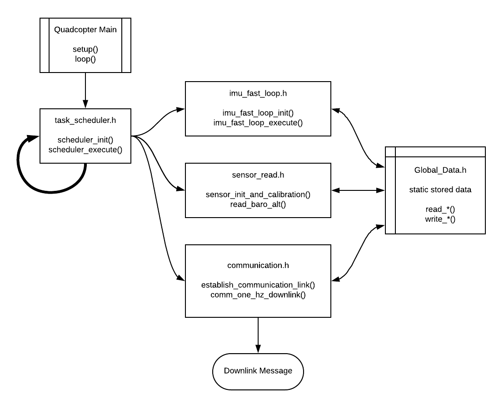

# APM_Controller

This is a repository for quadcopter autopilot code for use with the APM2.5 ardupilot board:  
http://ardupilot.org/copter/docs/common-apm25-and-26-overview.html  

The Arduino IDE/compiler used to build this code is stored here:  
https://app.box.com/s/bxm1pl6fn83seqxsumv649rlpxbngenm  

Libraries are copied from the ardupilot codebase for the last working version with APM2.5 boards.  
GitHub repo:  https://github.com/ArduPilot/ardupilot.git  
Branch: ArduCopter-3.2.1  

  
The main arduino sketch file is located in `Quadcopter_Main/`  
Supporting libraries for the sketch file are located in `libraries/A0_Quadcopter_Libs/`

#### To upload firmware with the Arduino IDE for the APM 2.5 microprocessor:
 1. Set sketchbook location in File->Preferences to the root of this git repository: `APM_Controller/` after cloning. (This is needed for the Arduino IDE to include the libraries directory)
 2. Set ArduPilot->HAL Board->"ArduPilot Mega 2.x"
 3. Set Tools->Board->"Arduino Mega 2560 or Mega ADK"
 4. Set Tools->Serial Port to the USB port the arduino unit is connected to (e.g. COM3).
 5. Open the "Quadcopter_Main" sketch and select File->Upload


## Current status - Release v0.1  
### *Scheduled Downlink of Sensor Data Test*

The code in this release provides just the basis for the architecture of the autopilot code.  
When the firmware is uploaded to the Arduino controller, there are four main components that run:
  - **Task Scheduler:** This schedules two tasks, read_baro() and comm_logging_downlink(), and how often they run.
  - **IMU Fast Loop:** This is the task which reads IMU data and waits for new samples in an attempt to closely align timestamps.
  - **Global Data:** This component is a repository for stored data that needs to be shared across different components.
  - **Sensor Read:** This has a task scheduled to run every 20ms to read the barometer altitude estimate. Both it and IMU Fast Loop publish their sensor readings to the Global Data component.
  - **Communication:** This has a task scheduled to run every 1000ms (1 Hz) and downlinks a string of data read from the Global Data component for debugging functionality on a computer.


  

Example output read from serial monitor:  
```
IMU ax:0.105344 ay:-1.076194 az:-9.989806 t:213.4157  Gyro wx:-0.000138 wy:0.000627 wz:-0.000042  Baro alt:0.628975 t:213.4167
IMU ax:0.095768 ay:-1.039083 az:-10.02332 t:214.4196  Gyro wx:-0.000670 wy:0.001692 wz:0.001021  Baro alt:0.519545 t:214.4207
IMU ax:0.128089 ay:-1.074997 az:-10.00537 t:215.4216  Gyro wx:-0.000670 wy:0.001159 wz:0.001021  Baro alt:1.261094 t:215.4227
IMU ax:0.113724 ay:-1.070208 az:-9.988609 t:216.4236  Gyro wx:-0.000138 wy:0.000627 wz:-0.000042  Baro alt:1.149547 t:216.4246
IMU ax:0.111330 ay:-1.091756 az:-9.967062 t:217.4260  Gyro wx:0.000393 wy:-0.000436 wz:0.001021  Baro alt:0.860580 t:217.4270
IMU ax:0.116118 ay:-1.096544 az:-10.00297 t:218.4281  Gyro wx:0.000393 wy:-0.000968 wz:0.000489  Baro alt:0.931760 t:218.4292
IMU ax:0.084994 ay:-0.967257 az:-10.07839 t:219.4305  Gyro wx:0.000925 wy:-0.001500 wz:0.000489  Baro alt:0.606665 t:219.4315
IMU ax:0.143652 ay:-1.015141 az:-10.03051 t:220.4330  Gyro wx:0.001457 wy:0.001159 wz:-0.000574  Baro alt:0.758590 t:220.4340
IMU ax:0.111330 ay:-1.094150 az:-9.973047 t:221.4350  Gyro wx:0.000393 wy:0.000095 wz:0.000489  Baro alt:1.000816 t:221.4361
IMU ax:0.089782 ay:-1.067814 az:-9.995792 t:222.4371  Gyro wx:0.000393 wy:0.000095 wz:-0.000042  Baro alt:0.806398 t:222.4381
IMU ax:0.112527 ay:-1.109712 az:-9.974244 t:223.4408  Gyro wx:0.000393 wy:0.000095 wz:0.001021  Baro alt:0.723530 t:223.4418
IMU ax:0.106542 ay:-1.091756 az:-10.00417 t:224.4431  Gyro wx:-0.000670 wy:0.000627 wz:0.000489  Baro alt:0.706532 t:224.4440
IMU ax:0.110133 ay:-1.096544 az:-9.992201 t:225.4467  Gyro wx:0.000393 wy:0.000095 wz:0.000489  Baro alt:0.592853 t:225.4478
IMU ax:0.111330 ay:-1.094150 az:-9.964667 t:226.4493  Gyro wx:-0.000670 wy:0.000627 wz:-0.001106  Baro alt:0.794712 t:226.4503
IMU ax:0.117315 ay:-1.070208 az:-10.01495 t:227.4517  Gyro wx:-0.000138 wy:-0.000436 wz:-0.000042  Baro alt:0.859518 t:227.4525
IMU ax:0.088585 ay:-1.089362 az:-10.00417 t:228.4536  Gyro wx:-0.001202 wy:0.000627 wz:0.001021  Baro alt:0.910513 t:228.4548
IMU ax:0.140060 ay:-1.076194 az:-10.00058 t:229.4564  Gyro wx:-0.000138 wy:0.000095 wz:0.000489  Baro alt:0.934948 t:229.4574
```


